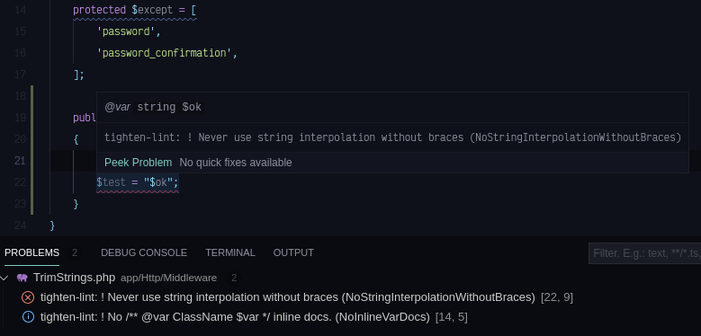

# Tighten Lint for VSCode

A VScode linter for [Tighten Lint](https://github.com/tightenco/tlint)



## Installation

* `CTRL` + `SHIFT` + `X` (`View: show extensions`)
* Search for tighten lint and click install 

## Features

* Customisable linter severities
* Customise executed linters

## Requirements

You must install the linter executable as per the [tlint](https://github.com/tightenco/tlint#install-requires-php71) install instructions.

## Extension Settings

| setting                        | default | description                                                                                           |
|--------------------------------|---------|-------------------------------------------------------------------------------------------------------|
| `tighten-lint.exec`            | `tlint` | The `tlint` executable path                                                                           |
| `tighten-lint.defaultSeverity` | `error` | The default violation severity (error, warning, info, hint)                                           |
| `tighten-lint.severities`      | `{}`    | Override default severity for specific [linter](https://github.com/tightenco/tlint#available-linters) |
| `tighten-lint.only`            | `[]`    | A list of the specific linters to run                                                                 |

### Example Configuration

```json
"tighten-lint.exec": "/usr/bin/tlint",
    "tighten-lint.defaultSeverity": "warning",
    "tighten-lint.only": [
        "AlphabeticalImports",
        "NoInlineVarDocs",
        "ImportFacades"
    ],
    "tighten-lint.severities": {
        "NoInlineVarDocs": "info"
    },
```

## Known Limitations

* Linting is limited to local files and will not work on uri schemes other the `file` e.g. `ssh`

## Contributing

See the [contributing](CONTRIBUTING.md) guide and [Code of Conduct](CODE_OF_CONDUCT.md)
